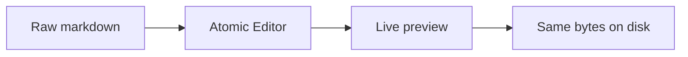

# Welcome to Atomic Markdown

This sample is for **F5** / Extension Development Host. Open it with **Atomic Markdown: Open with Atomic Markdown** (the default text editor stays the default).

Raw markdown is the source of truth. Decorations are view-only — copy or save should match a textarea.

## Emphasis and lists

You can use *emphasis*, **strong**, `inline code`, ~~strike~~, and ==highlights==.

- Tight bullet
- Another item
  - Nested
    1. Numbered under a bullet
    2. Still nested
- Back to the outer list

1. Numbered
2. Still numbered
   - Mixed with a bullet
   - And another

### Tasks

- [x] Scaffold the custom editor
- [ ] Toggle this checkbox
- [ ] Try reading mode from the editor title

> Blockquote: live preview should style this rail without changing the `>` in the file.
>
> Nested quote of a `code` span.

---

## Tables

Click a cell to edit it in place.

| Feature        | v1 |
| -------------- | -- |
| Live preview   | yes |
| WYSIWYG tables | yes |
| Wiki links     | no |

Wide table (scroll inside the editor, do not stretch the page):

| Language   | Fence   | Highlight | Notes                          | Extra |
| ---------- | ------- | --------- | ------------------------------ | ----- |
| TypeScript | `ts`    | yes       | jsx / typescript               | —     |
| Python     | `py`    | yes       |                                | —     |
| Go         | `go`    | yes       |                                | —     |
| Rust       | `rust`  | yes       |                                | —     |
| JSON       | `json`  | yes       |                                | —     |
| YAML       | `yaml`  | yes       |                                | —     |
| HTML       | `html`  | yes       |                                | —     |
| CSS        | `css`   | yes       |                                | —     |
| Shell      | `bash`  | yes       | also `sh` / `zsh`              | —     |
| SQL        | `sql`   | yes       |                                | —     |
| Mermaid    | `mermaid` | no      | fence only — no diagram runtime | v1    |

## Fences

```ts
export function greet(name: string): string {
  return `hello, ${name}`;
}
```

```js
export const greet = (name) => `hello, ${name}`;
```

```python
def greet(name: str) -> str:
    return f"hello, {name}"
```

```go
func greet(name string) string {
    return fmt.Sprintf("hello, %s", name)
}
```

```rust
fn greet(name: &str) -> String {
    format!("hello, {name}")
}
```

```json
{ "editor": "atomic-markdown" }
```

```yaml
editor: atomic-markdown
priority: option
```

```html
<p class="demo">Hello, <strong>Atomic</strong></p>
```

```css
.demo {
  color: var(--vscode-editor-foreground);
}
```

```bash
npm install && npm run compile
```

```sql
SELECT title FROM notes WHERE path LIKE '%.md';
```

Mermaid is included as real-world fence syntax. v1 has no mermaid runtime, so this stays a highlighted (or plain) code block:



## Images and links

Relative image (rewritten with `webview.asWebviewUri`):


Remote image:


A [relative markdown link](./other.md) opens with `vscode.open`. An [external link](https://github.com/ttaatoo/atomic-markdown) opens outside the workbench.
